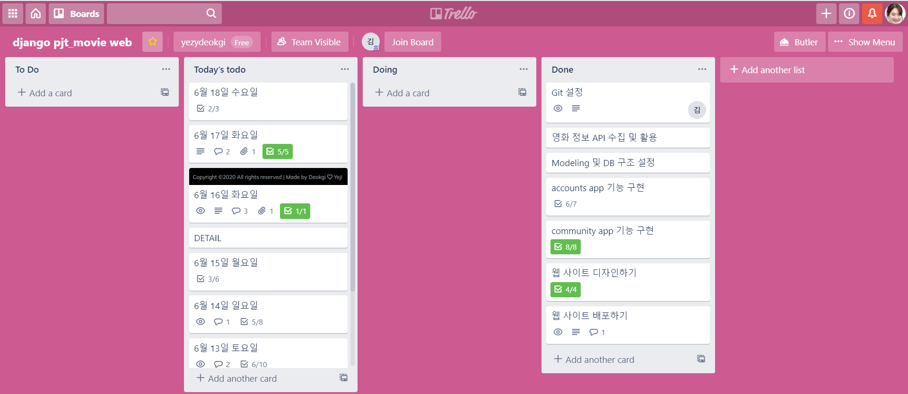
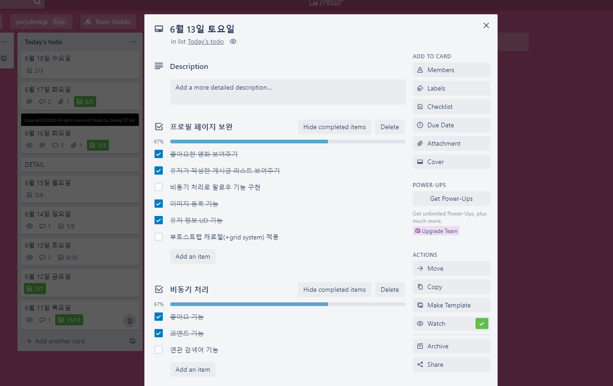
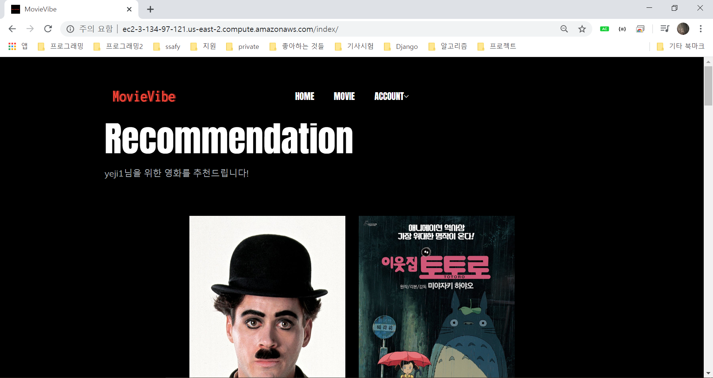
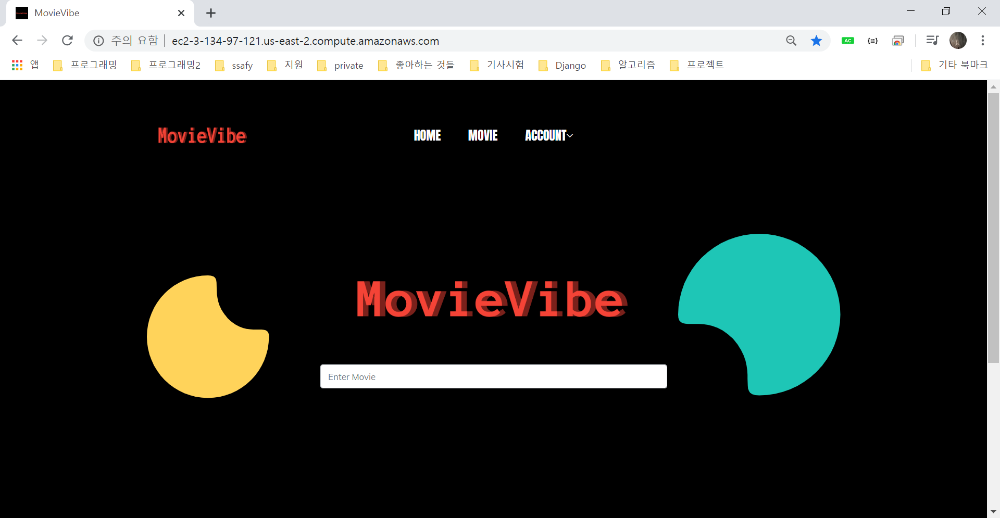

# MovieVibe_web project


### 0. 기술 스택

프로그래밍 언어 - Python, JavaScript, HTML, CSS

프레임워크 - Django

서비스 배포 환경 - AWS

Database - SQLite


### 1. 업무 분담 및 진행과정 

✔ 프로젝트 수행기간 - 2020.06.11(THU)- 2020.06.18(THU)

✔ 팀원

* 팀장 김덕기 - Back end, Front end

* 팀원 조예지 - Back end, Front end







### 2. 목표 서비스 및 주요 기능 소개

✔ 이번 프로젝트의 목표 서비스는  ①영화 정보 기반 추천 서비스 ②커뮤니티 서비스

✔ 주요 기능 소개

* 회원 관련 기능(회원가입, 로그인, 로그아웃, 회원탈퇴, 팔로우 및 팔로잉)

* 커뮤니티 기능(게시글 관련 CRUD 기능 구현, 좋아요 기능, 댓글 기능)

* 관리자 뷰, 영화 정보, 영화 추천 기능 등의 필수 기능을 모두 구현. 추가적으로 비동기적 영화 검색, 유튜브 API 활용한 예고편 영상 보기, 네이버 사이트 연계해주기 등 부수적인 기능들을  구현.


### 3. 사이트 배포 작업

🎞 URL : http://ec2-3-134-97-121.us-east-2.compute.amazonaws.com/


* 사이트 이미지






✔ AWS를 활용해 프로젝트를 배포

✔ 우리는 static 폴더를 사용했기 때문에 배포 전에  settings.py에 STATIC_ROOT를 추가해주기

`STATICFILES_DIRS`는 앱 밖의 상위에 static 파일을 둔 경우 이 위치를 찾을 수 있게 등록해주는 것이고, `STATIC_ROOT`의 경우 배포 과정에서 collectstatic 했을 때 static의 모든 파일을 저장할 위치를 지정해주는 것이다. 따라서 두 가지의 역할이 다르기 때문에 배포를 위해서는 두 가지 모두 정의해두어야 한다. 

```python
STATIC_URL = '/static/'

STATICFILES_DIRS = [
    os.path.join(BASE_DIR, 'static')
]

STATIC_ROOT = os.path.join(BASE_DIR, 'staticfiles')
```

✔ 배포 주요 과정은 교수님 도움을 통해서 진행함

✔ 추후 도메인 사서 붙여서 상용화 서비스 처럼 만들 예정


### 4. 새로 배운 점 및 문제 해결 과정

✔ 새로 사용해본 것들 -> message framework 사용, static으로 정적 파일 관리


✔ 영화의 장르 모델과 관련해서 두 가지 문제

​	① 관리자 기능 중 영화 정보 등록 시, form.html에서 모델폼을 불러올 때 genres가 object로만 출력됐는데 -> 		Genre 모델에  `__str__` 메소드 사용하여 표시방법 변경하였더니 올바르게 출력되었다.

```python
class Genre(models.Model):
    name = models.CharField(max_length=30)
    def __str__(self):
        return self.name
```

​	② 영화 디테일 페이지에서 영화 장르가 또 object로 출력이 되었고, genres가 id 포함한 쿼리셋 형태이기 때문		에 views.py에서 values로 리스트 형태로 넘겨주고, template에서 for문으로 장르를 모두 출력해주었다.

```python
# views.py
def detail(request, movie_pk):
    movie = Movie.objects.get(pk=movie_pk)
    genres = movie.genres.values('name')
    context = {
        'movie': movie,
        'genres': genres,
    }
    return render(request, 'movies/detail.html', context)
```

```python
# detail.html
장르 출력 -> {{ genre.name }}
```


✔ 영화 추천 기능 시 느린 속도 -> 쿼리 개선으로 해결

* 가져온 영화 데이터가 500개인데, 이때 영화 id 값이 일괄적이지 않고 들쑥날쑥하기 때문에 id 값의 최대값을 찾아서 그 아래 번호로 하나씩 뽑아와 해당 번호에 영화 데이터가 있는 경우에만 movies 리스트에 추가해주었다. 이때문에 영화 데이터를 불러오는데 많은 시간이 드는 문제가 있었다. 
* 영화 데이터를 리스트로 한번에 모두 가져오고, 랜덤함수로 번호들을 뽑아내고 이를  리스트의 인덱스로 사용하여 영화 데이터 가져오는 방법으로 바꿨더니 뚜렷하게 속도 개선이 되었다.
* 다만 아쉬운 점은 영화 추천 알고리즘을 따로 구상하여 만들지 못하고, 랜덤하게 영화를 불러온 것이다.

```python
    # 랜덤 영화 보여주기(기존)
    max_id = Movie.objects.all().aggregate(max_id=Max("id"))['max_id']
    movies = []
    while len(movies) < 10:
        pk = random.randint(1, max_id)
        movie = Movie.objects.filter(pk=pk).first()
        if movie:
            movies.append(movie)
    context = {
        'movies': movies[:9],
        'new_one': movies[-1],
    }
    
     # 속도 개선 후
    movies = Movie.objects.all()
    random_movies = []

    while len(random_movies) < 13:
        idx = random.randint(0, len(movies)-1)
        random_movies.append(movies[idx])
    
    context = {
        'movies': random_movies[:12],
        'new_one': random_movies[-1]
    }

    return render(request, 'movies/index.html', context)
```


✔ 프로필 페이지 만들기 -> 이미지 업로드 하는 방법(창완님 정리파일 참고함)

* 유저 모델을 커스텀할 때 유저가 이미지 파일 등록할 수 있게 image attribute를 정의함.
* 유저가 따로 이미지 파일을 등록하지 않은 경우에는 `default 값으로 기본 유저 이미지 설정`.
* 그리고 이미지 필드는 선택적으로 업로드 할 수 있게 `blank= True` 옵션을 넣어주기. 

```python
# models.py

from django.db import models
from django.contrib.auth.models import AbstractUser
from django.conf import settings
from imagekit.models import ProcessedImageField
from imagekit.processors import ResizeToFill, ResizeToFit, Thumbnail

class User(AbstractUser):
	followers = models.ManyToManyField(settings.AUTH_USER_MODEL, related_name="followings")
	image = ProcessedImageField(
		processors=[ResizeToFill(100, 100)],
		format='JPEG',
		options={'quality': 100},
		blank=True,
		default='profile_img.png')
	introduction = models.CharField(max_length=500, blank=True)
    
# forms.py의 CustomUserCreationForm, CustomUserChangeForm에서 image 필드 꺼내주기
```

* 그 외 forms.py 에서 `    <form action="" method='POST' enctype="multipart/form-data">` , `form=ReviewForm(request.POST,request.FILES)` 로 써주는 등  사용 방법이 길지만 간략하게 작성함(settings, urls.py로 정의해주기, 이미지 resizing 하는 방법도 있음)


✔ form.html을 여러 url 페이지에서 공유하기 때문에 `resolver_match` 사용하여 조건문 처리함 

​	e.g.) 


✔ 우리는 관리자 CRUD 기능을 따로 구현해냈다 -> 기능 구현 후 교수님께서 따로 구현할 필요 없다고 알려주셨	지만 후회는 없다..!

​	navbar와 영화 상세 페이지에서 `if request.user.is_superuser:` 조건을 통해 관리자인 경우에만 영화 정보 	등록/수정/삭제 기능이 가능하도록 처리하였다. 


### 5. 느낀점

📘 프로젝트를 진행하며 하나의 기능을 구현하기 위해서 여러 장벽들을 끊임없이 마주하는데 그때마다 검색해서 이를 해결할 때 제대로된 문서를 찾고 이해해서 적용하는 일이 힘들었지만 이런 과정에 익숙해지도록 더 노력하고 꾸준히 학습해야겠다. 


📘 프론트엔드는 할 때마다 어렵다는 것을 항상 느낀다...! 😂 기능 구현 후 처음 css 및 부트스트랩 적용하다가 한계를 느끼고 재빠르게 템플릿을 가져와 사용한 게 정말 잘한 일인 것 같다. 예전에 css를 배울 때 제대로 정리하지 못하고 넘겼던 게 지금 문제로 드러나는 것 같다. 특히 요소들을 배치하는 작업이 제일 어렵게 느껴진다. css는 시간 내서 다시 정리하기 체크.


📘 이번 프로젝트를 위해 일주일이 넘는 기간 동안 정말 열심히 달려온 것 같다. 아직 많은 기능이 들어가진 않았지만, 처음으로 만든 웹사이트를 내손으로 배포까지 완료해서 굉장히 뿌듯했다 ! 


